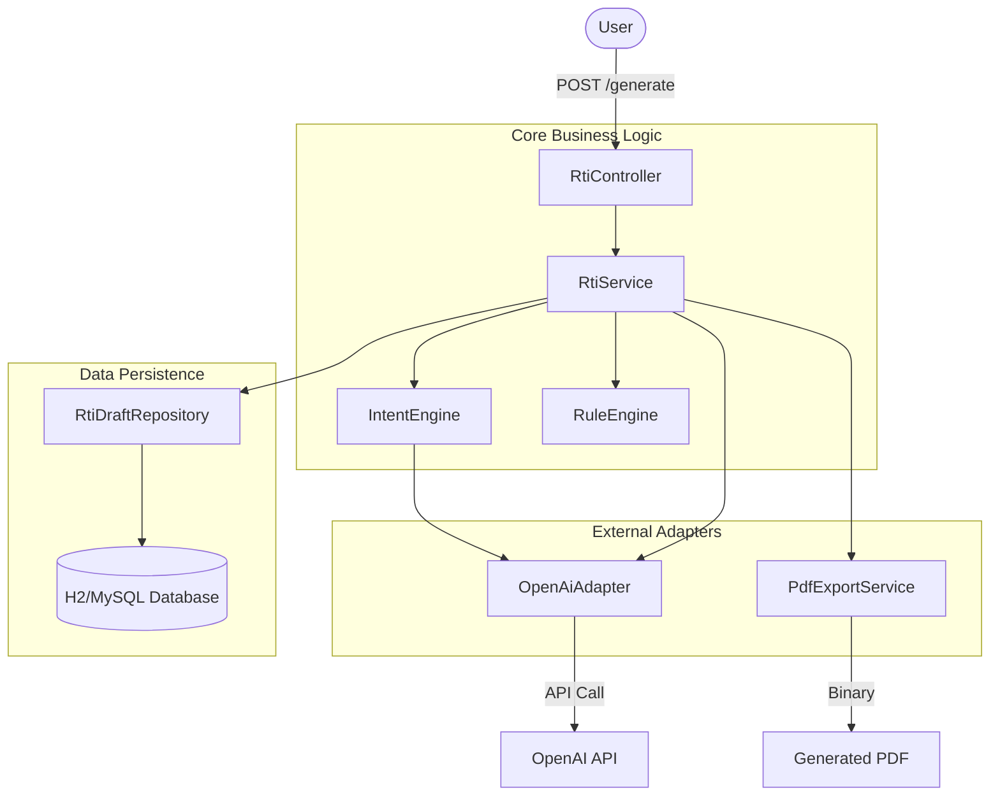

# RTI Generator: Deep Dive Architecture & Backend Guide

This document provides a comprehensive technical breakdown of the RTI Generator backend, explaining exactly how the system processes a user's request from a simple sentence to a legally compliant PDF.

---

## 🏗️ High-Level Service Architecture

The backend follows a standard **Controller-Service-Repository** pattern, enhanced with specialized "Adapters" and "Engines" for AI and Logic processing.

### Visual Dependency Graph


---

## 🔄 The Life of a Request (Step-by-Step)

### 1. The Entry Point: `RtiController`
*   **File**: `src/main/java/com/rtigen/api/RtiController.java`
*   **Endpoint**: `POST /api/v1/rti/generate`
*   **Input**: `GenerateRtiRequest` (contains `inputText` e.g., "Road broken in my street").
*   **Role**: Accepts the JSON payload, validates basic structure, and delegates strictly to the `RtiService`.

### 2. The Logic Orchestrator: `RtiService`
*   **File**: `src/main/java/com/rtigen/service/RtiService.java`
*   **Role**: The central coordinator avoiding "god class" anti-patterns by delegating to specialized engines.
*   **Workflow**:
    1.  **Analyze**: Calls `IntentEngine` to understand *what* the user wants.
    2.  **Generate**: Uses `IntentEngine` (which calls `AiAdapter`) to generate specific questions.
    3.  **Clean**: Post-processes the AI output (removes markdown, trims whitespace).
    4.  **Draft Creation**: Instantiates an `RtiDraft` object with the generated questions, subject, and department.
    5.  **Persist**: Saves the draft to the database via `RtiDraftRepository`.
    6.  **Return**: Sends the saved `RtiDraft` back to the controller.

### 3. The Intelligence Layer: `IntentEngine` & `OpenAiAdapter`
This is where the "magic" happens.

#### `IntentEngine` (`src/main/java/com/rtigen/engine/IntentEngine.java`)
*   **Privacy First**: Before sending anything to AI, it calls `PiiMaskingUtil`.
*   **Action**: It masks email addresses, phone numbers, and potential PII from the raw input text to ensure user privacy before it leaves the server.

#### `OpenAiAdapter` (`src/main/java/com/rtigen/adapter/ai/OpenAiAdapter.java`)
*   **Strategy**: Implements the `AiAdapter` interface.
*   **Prompt Engineering**:
    *   Constructs a detailed system prompt: *"You are an expert Indian RTI Act Drafting Assistant..."*
    *   Injects context: *"Subject: [Subject], Dept: [Dept]"*
    *   **Enforced Output**: Demands strict JSON or numbered list formats to ensure the backend can parse the response programmatically.
*   **Resilience**:
    *   **Fallback Mechanism**: If the OpenAI API Key is missing or the call fails, it gracefully degrades to a `LocalLlmAdapter` (mock) that returns simulated data so the app doesn't crash during development.
    *   **Cleaning**: Automatically strips "```json" markdown fences from GPT-4 responses.

### 4. The Compliance Officer: `RuleEngine`
*   **File**: `src/main/java/com/rtigen/engine/RuleEngine.java`
*   **Role**: Ensures the draft is legally stronger.
*   **Key Rules Implemented**:
    *   **"Why" Transformation**: The RTI Act doesn't allow asking "Why" (opinion). The engine automatically converts "Why is the road broken?" to **"Provide certified copies of records indicating reasons for..."** (Fact-based).
    *   **Opinion Flagging**: Detects words like "opinion" or "should" and warns the user.
    *   **Quality Score**: Calculates a score (0-100) based on valid questions vs. flagged issues.

### 5. The Output Layer: `PdfExportService`
*   **File**: `src/main/java/com/rtigen/adapter/pdf/PdfExportService.java`
*   **Library**: Apache PDFBox.
*   **Mechanism**:
    *   It does **not** convert HTML to PDF (which is flaky).
    *   It **draws** the PDF completely from scratch using a coordinate system (x, y).
    *   It places the "To, The Public Information Officer" block at exact coordinates to ensure it fits window envelopes.
    *   **Unicode Support**: Loads specific fonts to ensure Hindi (Devanagari) characters render correctly, which is often a point of failure in standard PDF libraries.

---

## 🛠️ Key Technical Decisions

| Component | Choice | Reason |
| :--- | :--- | :--- |
| **Framework** | Spring Boot 3.2 | Enterprise-grade reliability and DI container. |
| **PDF Engine** | Apache PDFBox | Low-level control over exact layout (critical for legal forms). |
| **DB Access** | Spring Data JPA | Simplified Repository pattern (No boilerplate SQL). |
| **AI Client** | RestTemplate | Simple, synchronous HTTP calls (WebClient was overkill for MVP). |
| **Validation** | Custom `RuleEngine` | Business logic for "Legal Compliance" is too complex for standard `@Valid` annotations. |

---

## 📚 Detailed API Reference

### `POST /api/v1/rti/generate`
**Request Payload**:
```json
{
  "inputText": "My scholarship money has not arrived yet. It has been 6 months."
}
```

**Response Payload**:
```json
{
  "id": "uuid-1234",
  "subject": "Delay in Scholarship Disbursement",
  "department": "Education Department",
  "questions": [
    "1. Provide the daily progress report of my application ID [ID].",
    "2. Provide the names and designations of officials responsible for the delay.",
    "3. Provide certified copies of the file notings indicating reasons for delay."
  ],
  "qualityScore": 90
}
```

### `POST /api/v1/rti/{id}/export/pdf`
*   **Returns**: `application/pdf` binary stream.
*   **Action**: Generates the final printable file on-the-fly.
